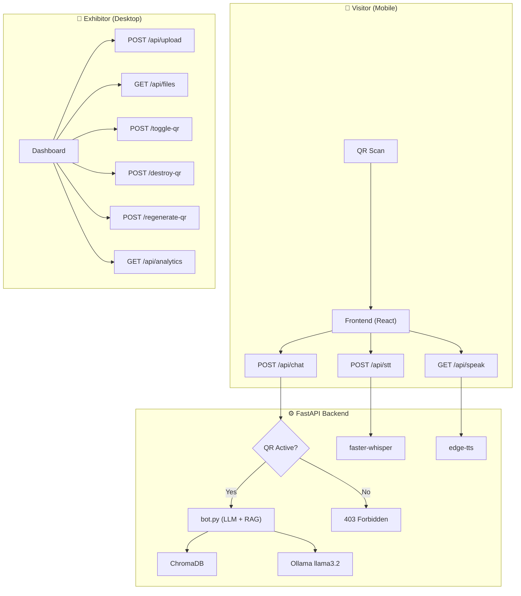
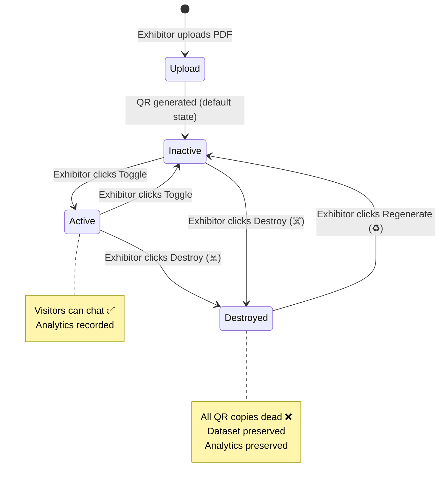
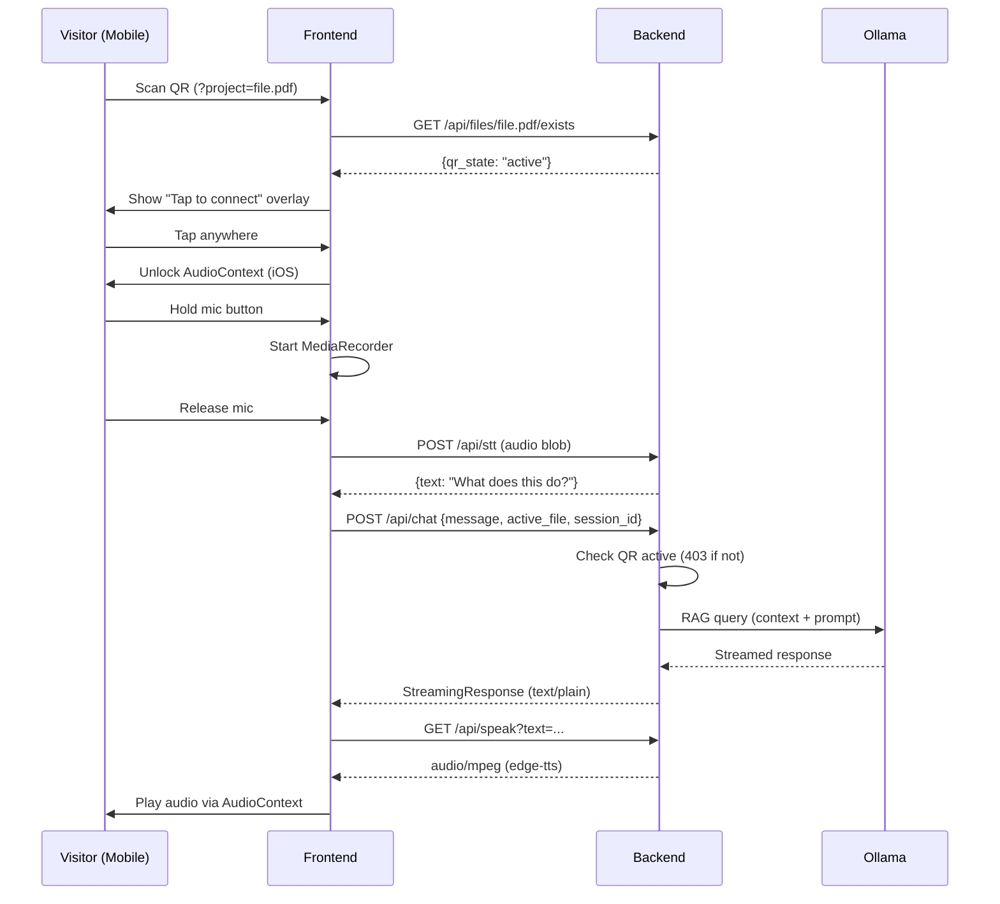

# Lumira — Full Project Audit

> **Date**: May 3, 2026  
> **Auditor**: Antigravity AI  
> **Scope**: Complete codebase review + all changes made in this session

---

## 1. Project Overview

**Lumira** is a full-stack AI Exhibition Assistant. Exhibitors upload documents (PDF/TXT/DOCX), and the system generates a QR code that visitors scan at a booth to interact with an AI chatbot that answers questions strictly from the uploaded content — via voice or text.

### Tech Stack

| Layer | Technology |
|---|---|
| **Frontend** | React (Vite), TailwindCSS, Lucide Icons |
| **Backend** | FastAPI (Python 3.x), Uvicorn |
| **LLM** | Ollama (llama3.2) via LangChain |
| **RAG** | ChromaDB vector store + LangChain retrievers |
| **STT** | faster-whisper (GPU-accelerated) |
| **TTS** | edge-tts (Microsoft Neural voices) |
| **Analytics** | SQLite (WAL mode, thread-local connections) |
| **Auth** | OTP-based exhibitor login |
| **Hosting** | Ngrok tunnel → local machine |

---

## 2. Architecture

---

## 3. File Inventory

### Backend (`backend/`)

| File | Size | Purpose |
|---|---|---|
| [main.py](file:///c:/Users/lenovo/PycharmProjects/Lumira/backend/main.py) | 1.5 KB | FastAPI app, CORS, router registration, static file serving |
| [bot.py](file:///c:/Users/lenovo/PycharmProjects/Lumira/backend/bot.py) | 21.7 KB | Core RAG engine — prompt templates, question classification, `ask_lumira()` generator |
| [analytics.py](file:///c:/Users/lenovo/PycharmProjects/Lumira/backend/analytics.py) | 7.1 KB | SQLite analytics — sessions, messages, aggregation, clear |
| [auth.py](file:///c:/Users/lenovo/PycharmProjects/Lumira/backend/auth.py) | 6.4 KB | OTP-based exhibitor authentication |
| [ingest.py](file:///c:/Users/lenovo/PycharmProjects/Lumira/backend/ingest.py) | 1.9 KB | Document ingestion pipeline (PDF/TXT/DOCX → ChromaDB) |
| [routes/chat.py](file:///c:/Users/lenovo/PycharmProjects/Lumira/backend/routes/chat.py) | 3.6 KB | `/api/chat`, `/api/stt`, `/api/speak` endpoints |
| [routes/files.py](file:///c:/Users/lenovo/PycharmProjects/Lumira/backend/routes/files.py) | 15.0 KB | File upload, list, delete, QR lifecycle (toggle/destroy/regenerate) |
| [routes/analytics_routes.py](file:///c:/Users/lenovo/PycharmProjects/Lumira/backend/routes/analytics_routes.py) | 2.0 KB | Analytics API endpoints |
| [routes/auth_routes.py](file:///c:/Users/lenovo/PycharmProjects/Lumira/backend/routes/auth_routes.py) | 0.9 KB | Auth API endpoints |
| [services/tts_service.py](file:///c:/Users/lenovo/PycharmProjects/Lumira/backend/services/tts_service.py) | 2.9 KB | edge-tts integration with text sanitization |
| [services/stt_service.py](file:///c:/Users/lenovo/PycharmProjects/Lumira/backend/services/stt_service.py) | — | faster-whisper STT model loading |

### Frontend (`frontend/src/`)

| File | Size | Purpose |
|---|---|---|
| [App.jsx](file:///c:/Users/lenovo/PycharmProjects/Lumira/frontend/src/App.jsx) | 25.2 KB | Root component — view router, all handlers, state management |
| [components/ChatView.jsx](file:///c:/Users/lenovo/PycharmProjects/Lumira/frontend/src/components/ChatView.jsx) | 27.4 KB | Chat UI — messages, input bar, mic, slide-to-cancel, listening overlay |
| [components/Dashboard.jsx](file:///c:/Users/lenovo/PycharmProjects/Lumira/frontend/src/components/Dashboard.jsx) | 28.5 KB | Exhibitor dashboard — file list, analytics, QR lifecycle controls |
| [components/LandingPage.jsx](file:///c:/Users/lenovo/PycharmProjects/Lumira/frontend/src/components/LandingPage.jsx) | 15.5 KB | Public landing page with features showcase |
| [components/AnimatedQR.jsx](file:///c:/Users/lenovo/PycharmProjects/Lumira/frontend/src/components/AnimatedQR.jsx) | 18.7 KB | QR code generation with animated border |
| [components/PhoneDemo.jsx](file:///c:/Users/lenovo/PycharmProjects/Lumira/frontend/src/components/PhoneDemo.jsx) | 15.1 KB | Interactive phone mockup demo on landing page |
| [components/ExhibitorLogin.jsx](file:///c:/Users/lenovo/PycharmProjects/Lumira/frontend/src/components/ExhibitorLogin.jsx) | 8.2 KB | OTP login flow |
| [components/DatasetNotFound.jsx](file:///c:/Users/lenovo/PycharmProjects/Lumira/frontend/src/components/DatasetNotFound.jsx) | 4.7 KB | Error page for deleted datasets |
| [components/QrUnavailable.jsx](file:///c:/Users/lenovo/PycharmProjects/Lumira/frontend/src/components/QrUnavailable.jsx) | 5.6 KB | ✨ **New** — Page for inactive/destroyed QR scans |
| [components/ThankYou.jsx](file:///c:/Users/lenovo/PycharmProjects/Lumira/frontend/src/components/ThankYou.jsx) | 5.5 KB | ✨ **New** — Visitor goodbye page after exiting chat |
| [hooks/useAudio.js](file:///c:/Users/lenovo/PycharmProjects/Lumira/frontend/src/hooks/useAudio.js) | 5.8 KB | TTS audio playback (AudioContext, parallel fetch, gapless mobile) |
| [hooks/useRecorder.js](file:///c:/Users/lenovo/PycharmProjects/Lumira/frontend/src/hooks/useRecorder.js) | 5.4 KB | MediaRecorder hook with cancel support |

---

## 4. All Changes Made This Session

### 4.1 Anti-Hallucination Guardrails

| What | Where | Detail |
|---|---|---|
| Temperature drop | [bot.py:20](file:///c:/Users/lenovo/PycharmProjects/Lumira/backend/bot.py#L20) | `0.7` → `0.2` — drastically reduces creative guessing |
| Prompt hardening | [bot.py:85-188](file:///c:/Users/lenovo/PycharmProjects/Lumira/backend/bot.py#L85-L188) | All 5 prompt templates now include explicit rules: "NEVER invent names, terms, acronyms, or features not in Context" |
| Context quality gate | [bot.py:490-497](file:///c:/Users/lenovo/PycharmProjects/Lumira/backend/bot.py#L490-L497) | Detects empty/irrelevant retrieval → polite "I don't have that information" instead of hallucination |

### 4.2 QR Lifecycle System (Three-State)

> [!IMPORTANT]
> This is the core security feature. QRs now go through: **INACTIVE → ACTIVE → DESTROYED**, with an option to **REGENERATE** after destruction.

| State | Visitors Can Chat? | Badge Color | Exhibitor Actions |
|---|---|---|---|
| `inactive` | ❌ | 🟡 Amber | Toggle → Active, Destroy |
| `active` | ✅ | 🟢 Green | Toggle → Inactive, Destroy |
| `destroyed` | ❌ | 💀 Gray | Regenerate (→ Inactive) |

**Files changed:**

| File | Changes |
|---|---|
| [routes/files.py](file:///c:/Users/lenovo/PycharmProjects/Lumira/backend/routes/files.py) | Three-state JSON persistence (`.qr_status.json`), backwards-compatible boolean migration, 4 endpoints: `toggle-qr`, `destroy-qr`, `regenerate-qr`, `exists` |
| [routes/chat.py](file:///c:/Users/lenovo/PycharmProjects/Lumira/backend/routes/chat.py#L78-L83) | 403 guard checks `_is_qr_active()` on every chat request |
| [App.jsx](file:///c:/Users/lenovo/PycharmProjects/Lumira/frontend/src/App.jsx) | `handleToggleQr`, `handleDestroyQr`, `handleRegenerateQr` handlers + QR scan validation uses `qr_state` |
| [Dashboard.jsx](file:///c:/Users/lenovo/PycharmProjects/Lumira/frontend/src/components/Dashboard.jsx) | Three-state badge, Skull destroy button, RefreshCcw regenerate button, Play hidden for destroyed |

**API Endpoints:**

| Method | Endpoint | Purpose |
|---|---|---|
| `GET` | `/api/files/{filename}/exists` | Returns `qr_state` + `qr_active` |
| `POST` | `/api/files/{filename}/toggle-qr` | Inactive ↔ Active (rejects destroyed) |
| `POST` | `/api/files/{filename}/destroy-qr` | Sets state to `destroyed` |
| `POST` | `/api/files/{filename}/regenerate-qr` | Destroyed → Inactive |

### 4.3 Slide-to-Cancel Voice Recording (WhatsApp-Style)

| File | Changes |
|---|---|
| [useRecorder.js](file:///c:/Users/lenovo/PycharmProjects/Lumira/frontend/src/hooks/useRecorder.js) | Added `cancelRecording()` — sets `cancelledRef` flag, `onstop` handler discards audio if flag is set |
| [ChatView.jsx](file:///c:/Users/lenovo/PycharmProjects/Lumira/frontend/src/components/ChatView.jsx) | Touch tracking (`touchStart`/`touchMove`/`touchEnd`), 100px threshold, recording timer, animated `‹ slide to cancel` hint, red cancel zone with ✕ icon |
| [App.jsx](file:///c:/Users/lenovo/PycharmProjects/Lumira/frontend/src/App.jsx) | Passes `onCancelRecording` prop |

**Behavior:**
- Hold mic → recording starts, overlay shows timer + "slide to cancel"
- Slide left >100px → overlay turns red, icon becomes ✕, text says "Release to cancel"
- Release in cancel zone → audio discarded, nothing sent
- Release normally → audio sent to STT → bot answers

### 4.4 Mobile Input Bar Responsiveness Fix

| Problem | Fix |
|---|---|
| Mic button pushed off-screen on narrow mobile viewports | Added `minWidth: 0` on flex container + `boxSizing: 'border-box'` on input + reduced padding from `52px/20px` to `48px/16px` |

### 4.5 Visitor Exit Button + Thank You Page

| Feature | File | Detail |
|---|---|---|
| Exit button | [ChatView.jsx](file:///c:/Users/lenovo/PycharmProjects/Lumira/frontend/src/components/ChatView.jsx) | Red `LogOut` icon in header, visible only for QR visitors (`isLocked && !isAdmin`) |
| Exit handler | [App.jsx](file:///c:/Users/lenovo/PycharmProjects/Lumira/frontend/src/App.jsx) | `handleExitChat` — stops audio, clears session, removes URL params, navigates to goodbye |
| Thank You page | [ThankYou.jsx](file:///c:/Users/lenovo/PycharmProjects/Lumira/frontend/src/components/ThankYou.jsx) | Animated heart, gradient text, "SESSION_COMPLETE" shimmer tag |

### 4.6 QR Unavailable Page (Destroyed/Inactive Scans)

| File | Detail |
|---|---|
| [QrUnavailable.jsx](file:///c:/Users/lenovo/PycharmProjects/Lumira/frontend/src/components/QrUnavailable.jsx) | Two modes: **Destroyed** → "QR Code Expired / This event has ended" · **Inactive** → "Project Unavailable / not yet enabled" |
| [App.jsx](file:///c:/Users/lenovo/PycharmProjects/Lumira/frontend/src/App.jsx) | `errorReason` state routes to `qr-unavailable` view vs `error` view based on whether file exists |

---

## 5. Data Flow Diagram

### Exhibition Lifecycle

### Visitor Chat Flow

---

## 6. Security Assessment

### ✅ Strengths

| Area | Implementation |
|---|---|
| **QR Access Control** | Three-state lifecycle with server-side enforcement on every `/api/chat` request |
| **Path Traversal Protection** | `_sanitize_filename()` strips `..`, `/`, and dangerous characters |
| **CORS** | Restricted to configured origins via `CORS_ORIGINS` env var |
| **Session Isolation** | `session_id`-scoped conversation memory prevents context bleeding |
| **Input Validation** | File extension whitelist, filename sanitization, size limits |

### ⚠️ Areas to Watch

| Area | Risk | Recommendation |
|---|---|---|
| **No rate limiting** | Chat/STT endpoints have no throttle — a malicious user could hammer the API | Add `slowapi` or middleware-based rate limiting |
| **No auth on chat** | Anyone with the URL can chat if QR is active — no per-visitor auth | Acceptable for exhibitions; add JWT tokens if going to production |
| **QR URL is deterministic** | URL is `?project=filename` — guessable if filenames are known | Consider adding a random token to QR URLs |
| **No HTTPS enforcement** | Relies on ngrok for TLS — direct connections are HTTP | Fine for ngrok; enforce HTTPS headers if self-hosting |
| **SQLite concurrency** | WAL mode + thread-local connections handle moderate load, but may bottleneck at scale | Monitor under load; migrate to PostgreSQL if needed |
| **`.qr_status.json` on disk** | File-based state could corrupt under race conditions | Unlikely at exhibition scale; consider SQLite if concerned |

---

## 7. Performance Profile

| Component | Latency | Notes |
|---|---|---|
| **STT (faster-whisper)** | ~1-3s | GPU-accelerated, `beam_size=5` for accuracy |
| **RAG retrieval** | ~0.2-0.5s | ChromaDB with cached retriever |
| **LLM inference** | ~2-8s | Ollama llama3.2 local, `temperature=0.2`, `keep_alive=30m` |
| **TTS (edge-tts)** | ~0.5-2s | Cloud API, parallel sentence fetching on frontend |
| **Total round-trip** | ~4-12s | Acceptable for exhibition booth interaction |

---

## 8. Build Status

| Check | Result |
|---|---|
| Frontend build (`vite build`) | ✅ Clean — 0 errors, 0 warnings |
| Backend syntax (`ast.parse`) | ✅ All Python files valid |
| Git status | Clean working tree (all committed) |
| Dependencies | All listed in `requirements.txt` |

---

## 9. Known Limitations

1. **Single LLM instance** — Only one Ollama model loaded. Multiple concurrent visitors share the same inference pipeline (sequential).
2. **No WebSocket** — Chat uses HTTP streaming, not WebSocket. Each message is a separate request.
3. **No offline mode** — TTS requires internet (edge-tts is cloud-based). STT is local.
4. **No multi-language** — STT has an English initial prompt. TTS uses English voices. Context is assumed English.
5. **No file versioning** — Re-uploading a file overwrites the previous one. No history of changes.

---

## 10. Recommendations for Next Steps

| Priority | Item | Effort |
|---|---|---|
| 🔴 High | Add rate limiting (`slowapi`) to prevent API abuse | 30 min |
| 🟡 Medium | Add random tokens to QR URLs for security | 2 hrs |
| 🟡 Medium | Add a "Confirm before sending" toast when voice recording is very short | 30 min |
| 🟢 Low | Migrate `.qr_status.json` to SQLite alongside analytics | 1 hr |
| 🟢 Low | Add multi-language support (detect language from document) | 4 hrs |
| 🟢 Low | Export analytics as CSV from dashboard | 1 hr |
